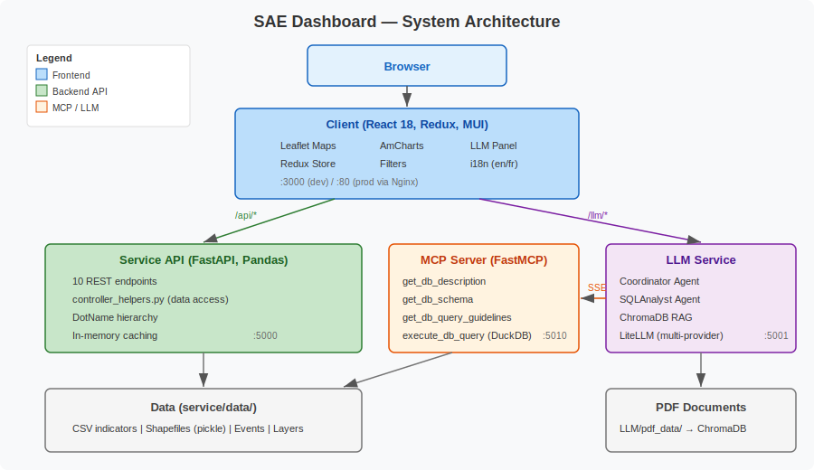

# Architecture & Design

## System Overview

The SAE Dashboard is a three-service architecture with an optional MCP bridge for AI-powered data access.



## Services

| Service | Stack | Port | Purpose |
|---------|-------|------|---------|
| **Client** | React 18, Redux, MUI, Leaflet, AmCharts | 3000 (dev) / 80 (prod) | Interactive map dashboard |
| **Service** | FastAPI, Pandas, Uvicorn | 5000 | REST API for indicator data and shapes |
| **MCP Server** | FastMCP, DuckDB | 5010 | SQL query interface over CSV data for LLM tools |
| **LLM** | FastAPI, Google Agent SDK, LiteLLM, ChromaDB | 5001 | AI agent orchestration (RAG + SQL) |

## Frontend Architecture

```
client/src/
├── index.js                  Entry point
├── app_config.json           Default indicators, years, themes
├── setupProxy.js             /api → :5000, /llm → :5001
├── components/
│   ├── layout/Layout.js      AppBar, navigation, LLM drawer
│   ├── MapPanel.js           Primary/comparison map container
│   ├── MapPanelMap.js        Map data fetching + rendering
│   ├── StateData.js          Time-series container
│   ├── StateDataChart.js     Individual chart component
│   ├── LLMClient.js          AI assistant panel
│   ├── filterelements/       Year, indicator, subgroup, theme filters
│   └── uielements/           Map, LineChart, StackedBarChart, ExportImage
├── views/                    Welcome, Dashboard, About, Instructions, Libraries
├── redux/
│   ├── store.js              Redux store with API middleware
│   ├── actions/              dashboard.js (data fetch), filters.js (state changes)
│   ├── reducers/             dashboard.js (geo/layer data), filters.js (all filter state)
│   └── middlewares/api.js    Axios-based API call middleware
└── data/translation/         i18n message files (en, fr)
```

**State management:** Redux store with two reducers — `filters` (all user selections) and `dashboard` (fetched GeoJSON, events, layers). API calls are dispatched as actions and handled by the API middleware.

**Proxy setup:** In development, `setupProxy.js` forwards `/api/*` to the Service and `/llm/*` to the LLM service.

## Backend Architecture

```
service/
├── app.py                    FastAPI app, mounts 10 routers
├── default_settings.py       DATA_DIR, DEBUG, AKS config
├── config.yaml               Disaggregated indicator list
├── controllers/              One file per endpoint
│   ├── map.py                GET /map — choropleth values
│   ├── timeseries.py         GET /timeseries — trend data
│   ├── indicators.py         GET /indicators — available indicators
│   ├── shapes.py             GET /shapes — GeoJSON boundaries
│   ├── subgroups.py          GET /subgroups — demographic groups
│   ├── dot_names.py          GET /dot_names — region hierarchy
│   ├── years.py              GET /years — temporal bounds
│   ├── events.py             GET /events — timeline events
│   ├── layer_data.py         GET /layer_data — overlay data
│   └── africa_map.py         GET /africa_map — continental GeoJSON
├── schemas/                  Pydantic response models
├── helpers/
│   ├── controller_helpers.py Core data access (file discovery, CSV loading, caching, filtering)
│   └── dot_name.py           DotName class for hierarchy operations
├── mcp_server.py             FastMCP server (4 tools: db description, schema, guidelines, query)
└── data/                     CSV indicators, shapefiles, events, layers
```

**Data access pattern:** Controllers parse request params → call helper functions → load/filter cached DataFrames → return Pydantic-validated JSON.

**Caching:** `DATA_CACHE` (DataFrames) and `SHAPE_CACHE` (GeoJSON) are module-level dicts populated on first access or at startup via `populate_cache()`.

## LLM Agent Architecture

```
LLM/
├── app.py                    FastAPI app (port 5001)
├── common.py                 Model configs, paths, API keys
├── controllers/
│   └── llm_runner.py         POST /run endpoint
└── workflow/
    ├── agent.py              Coordinator agent (GlobalHealthRouter)
    ├── sql_agent.py          SQLAnalyst sub-agent (MCP tools)
    ├── vector_db.py          ChromaDB RAG (PDF ingestion + search)
    └── data_tools.py         MCP toolset creation (SSE connection)
```

**Agent routing logic:**
1. General health questions → answer directly from LLM knowledge
2. Quantitative data queries → delegate to SQLAnalyst agent → MCP tools → DuckDB over CSVs
3. Document-based questions → `ask_vector_db` tool → ChromaDB similarity search

## API Endpoints

| Endpoint | Method | Key Parameters | Returns |
|----------|--------|----------------|---------|
| `/dot_names` | GET | `dot_name` | Child regions with id/text |
| `/indicators` | GET | `dot_name`, `use_descendant_dot_names` | Indicator metadata (levels, subgroups, time range) |
| `/subgroups` | GET | `dot_name`, `admin_level` | Available demographic subgroups |
| `/shapes` | GET | `dot_name`, `admin_level`, `shape_version` | GeoJSON FeatureCollections |
| `/map` | GET | `dot_name`, `channel`, `subgroup`, `year`, `admin_level` | Per-region indicator values |
| `/timeseries` | GET | `dot_name`, `channel`, `subgroup` | Yearly estimates with bounds |
| `/years` | GET | `dot_name`, `channel`, `subgroup` | Start/end year range |
| `/events` | GET | — | Event list with dates |
| `/layer_data` | GET | — | Overlay layer JSON |
| `/africa_map` | GET | — | Continental GeoJSON |

## Deployment

**Docker Compose** (`docker-compose.local.yml`) orchestrates all four services. The client Dockerfile is a multi-stage build: Node 20 builds the React app, then Nginx serves the static bundle and proxies API requests.

**Production:** Nomad job specs (`jobspec.nomad`, `jobspec_acc.nomad`) for deployment on HashiCorp Nomad. CI via Drone (`.drone.yml`).

## Key Design Decisions

- **CSV-based storage** instead of a database — simplifies deployment and data updates; DuckDB used only in MCP for ad-hoc SQL queries
- **Pickle for shapefiles** — avoids repeated GeoJSON parsing; cached in memory after first load
- **Dual-map layout** — comparison is a primary use case for policymakers evaluating interventions
- **Dot name hierarchy** — colon-separated strings enable simple ancestor/descendant queries without a tree data structure
- **MCP as LLM bridge** — decouples the LLM agent from direct data access; the same MCP tools work for any LLM provider
