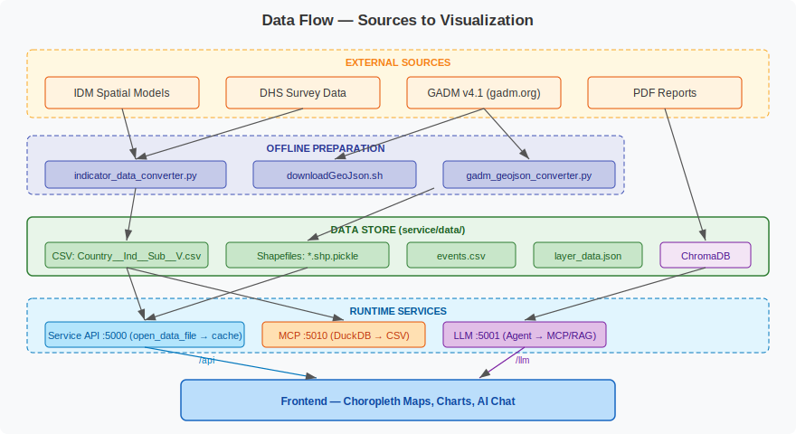

# Data Ecosystem

## Overview

The dashboard consumes three categories of data: **indicator CSVs** (model outputs), **shapefiles** (geographic boundaries), and **supplementary data** (events, layers). All data lives under `service/data/`.

## Indicator CSV Files

**Location:** `service/data/data/`

**Naming convention:**
```
{Country}__{Indicator}__{Subgroup}__{Version}.csv
```

**Examples:**
- `Senegal__modern_method__all__1.csv`
- `Senegal__traditional_method__25plus_urban__1.csv`
- `Senegal__unmet_need__15-24_Parity-0__1.csv`

**Column structure:**

| Column | Description |
|--------|-------------|
| `state` | Dot name identifier (e.g., `Africa:Senegal:Dakar`) |
| `{indicator}` | DHS reference value (observed survey estimate, may be empty) |
| `se.{indicator}` | Standard error of reference value |
| `year` | Year of estimate |
| `pred` | Model prediction (central estimate) |
| `pred_upper` | Upper bound of 95% credible interval |
| `pred_lower` | Lower bound of 95% credible interval |

**Sample row:**
```csv
Africa:Senegal:Dakar,0.0978,0.0090,1993,0.0931,0.1107,0.0781
```

Rows with empty reference values indicate years where no DHS survey was conducted — only model predictions are available.

**Current dataset:** 39 files (3 indicators x 13 subgroups), ~2,125 rows each, covering 14 regions and ~45 districts from ~1990 to 2020+.

## Shapefile Data

**Location:** `service/data/shapefiles/`

**Naming convention:**
```
{Country}__l{AdminLevel}__{Version}.shp.pickle
```

- `l2` = Admin Level 1 (regions) — confusingly offset by 1 from GADM levels
- `l3` = Admin Level 2 (districts)

**Format:** Python pickle files containing dictionaries of GeoJSON features keyed by dot name.

**Structure per feature:**
```json
{
  "Africa:Senegal:Dakar": {
    "type": "Feature",
    "id": "Africa:Senegal:Dakar",
    "properties": {
      "country": "Senegal",
      "TYPE": 1,
      "id": "Africa:Senegal:Dakar",
      "name": "Dakar"
    },
    "geometry": { "type": "Polygon", "coordinates": [...] }
  }
}
```

**Source:** GADM v4.1 GeoJSON files downloaded from `https://geodata.ucdavis.edu/gadm/gadm4.1/json/` and converted using `service/helpers/gadm_geojson_converter.py`.

## Supplementary Data

### Events (`service/data/events.csv`)

Timeline events (health campaigns, policy changes) for contextualizing data trends:
```csv
event,start_date,end_date
Test Event 01,2024-05-05,2024-05-06
```

### Layer Data (`service/data/layer_data.json`)

Additional geospatial point data (e.g., collection sites, sample-level data) for map overlay layers. Structured as nested JSON: `Country → DataLayer → Year → Site → Properties`.

### Africa Map (`service/data/Africa.shp.pickle`)

Continental-level GeoJSON for the Africa overview map.

## Data Preparation Tools

| Tool | Purpose |
|------|---------|
| `service/helpers/downloadGeoJson.sh` / `.cmd` | Download GADM boundary files for a country |
| `service/helpers/gadm_geojson_converter.py` | Convert GADM GeoJSON → pickled dictionary format |
| `service/helpers/indicator_data_converter.py` | Convert raw indicator CSVs to standardized format |

## Data Flow Diagram



## Adding Data for a New Country

1. Download GADM GeoJSON files using `downloadGeoJson.sh` (edit country code)
2. Run `gadm_geojson_converter.py` to create `.shp.pickle` files
3. Place indicator CSVs in `service/data/data/` following the naming convention
4. Optionally add events to `events.csv` and update `layer_data.json`
5. Update `client/src/app_config.json` with defaults for the new country
