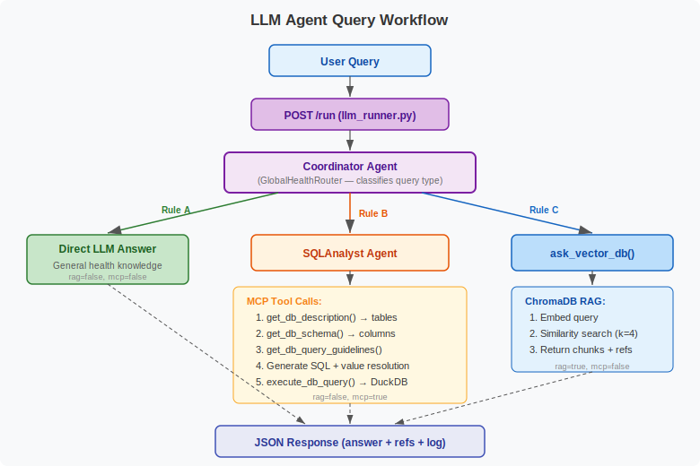

# Data Workflows

## Indicator Data Pipeline

### 1. Data Preparation (Offline)

Raw model outputs are converted to the dashboard's CSV format using `service/helpers/indicator_data_converter.py`:

```
Model Output (various formats)
    ↓
indicator_data_converter.py
    ↓
Standardized CSV: {Country}__{Indicator}__{Subgroup}__{Version}.csv
    ↓
Placed in service/data/data/
```

### 2. Geographic Boundary Preparation (Offline)

```
GADM v4.1 GeoJSON (gadm.org)
    ↓
downloadGeoJson.sh  →  gadm41_SEN_1.json, gadm41_SEN_2.json
    ↓
gadm_geojson_converter.py
    ↓
Pickled dict: {Country}__l{Level}__{Version}.shp.pickle
    ↓
Placed in service/data/shapefiles/
```

### 3. CSV Loading and Transformation (Runtime)

When the backend serves a request, `controller_helpers.open_data_file()` performs these transformations:

**Column renaming:**

| CSV Column | Internal Name |
|------------|---------------|
| `state` | `dot_name` |
| `{indicator}` | `reference` |
| `se.{indicator}` | `reference_stderr` |
| `pred` | `data` |
| `pred_upper` | `data_upper_bound` |
| `pred_lower` | `data_lower_bound` |

**Confidence interval calculation** for reference (survey) data:
```
reference_lower_bound = reference - (reference_stderr × 1.96)
reference_upper_bound = reference + (reference_stderr × 1.96)
```

The 1.96 multiplier produces 95% confidence intervals from the standard error. After computing bounds, `reference_stderr` is dropped.

**Caching:** Transformed DataFrames are stored in `DATA_CACHE` (module-level dict) and reused for subsequent requests.

### 4. File Discovery

`controller_helpers.get_data_filenames()` uses regex matching against the naming convention:
```
Pattern: {country}__{channel}__{subgroup}__{version}.csv
```

This enables dynamic discovery of available indicators, subgroups, and versions without maintaining a separate registry.

## Request-Response Workflows

### Map Data Request

```
GET /map?dot_name=Africa:Senegal&channel=modern_method&subgroup=all&year=2020&admin_level=2
    ↓
Parse params (read_dot_names, read_channel, read_year, read_admin_level)
    ↓
get_dataframe("Senegal", "modern_method", "all", 1)
    ↓
open_data_file() → load CSV, rename columns, compute CI bounds, cache
    ↓
Filter: dot_name descendants at admin_level=2, year=2020
    ↓
Return: [{id: "Africa:Senegal:Dakar", value: 0.25, data_lower_bound: 0.20, ...}, ...]
```

### Time-Series Request

```
GET /timeseries?dot_name=Africa:Senegal:Dakar&channel=modern_method&subgroup=all
    ↓
get_dataframe() → cached or load
    ↓
Filter: exact dot_name match
    ↓
Return: [{year: 1993, middle: 0.093, lower_bound: 0.078, upper_bound: 0.111, ...}, ...]
```

### Shape Request

```
GET /shapes?dot_name=Africa:Senegal&admin_level=2&shape_version=1
    ↓
get_shape_filename("Senegal", 2, 1) → "Senegal__l2__1.shp.pickle"
    ↓
load_geojson_pickle() → SHAPE_CACHE lookup or unpickle
    ↓
Filter features matching dot_name descendants
    ↓
Return: GeoJSON FeatureCollection
```

## LLM Query Workflow



### Data Query Path (MCP)

```
User: "Which region has highest modern method in 2020?"
    ↓
Coordinator Agent classifies → quantitative data query
    ↓
SQLAnalyst Agent:
  1. get_db_description() → table catalog
  2. get_db_schema(["Senegal__modern_method__all__1"]) → columns, samples
  3. get_db_query_guidelines() → SQL patterns, value resolution rules
  4. Generate SQL: SELECT state, pred FROM ... WHERE year=2020 ORDER BY pred DESC LIMIT 1
  5. Value resolution: fuzzy-match user region names to dot names
  6. execute_db_query() → DuckDB runs SQL against CSV
    ↓
Format answer with source attribution
```

### Document Query Path (RAG)

```
User: "What barriers to family planning exist in Senegal?"
    ↓
Coordinator Agent classifies → document-based question
    ↓
ask_vector_db(query):
  1. Load ChromaDB with BAAI/bge-small-en-v1.5 embeddings
  2. Similarity search → 4 most relevant chunks
  3. Return text + references (source, page, chunk_id)
    ↓
Coordinator synthesizes answer from retrieved context
```

## Data Caching Strategy

| Cache | Scope | Key | Populated |
|-------|-------|-----|-----------|
| `DATA_CACHE` | CSV DataFrames | File path | On first access or startup |
| `SHAPE_CACHE` | GeoJSON dicts | File path | On first access or startup |
| `populate_cache()` | Both | All files | Called at startup (optional) |

The MCP server does **not** currently cache DataFrames (TODO in `mcp_server.py`) — each `execute_db_query` call reloads referenced CSVs.
